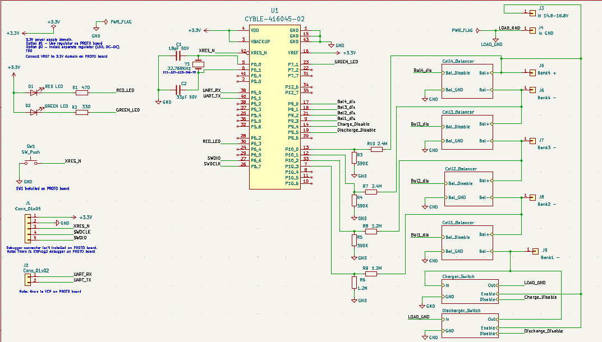
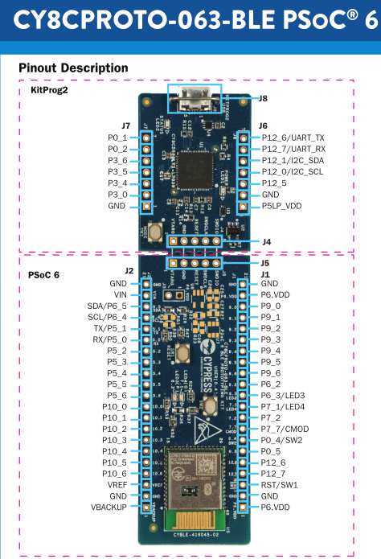
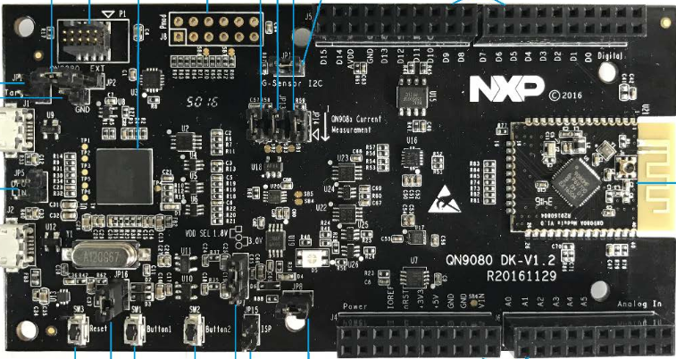
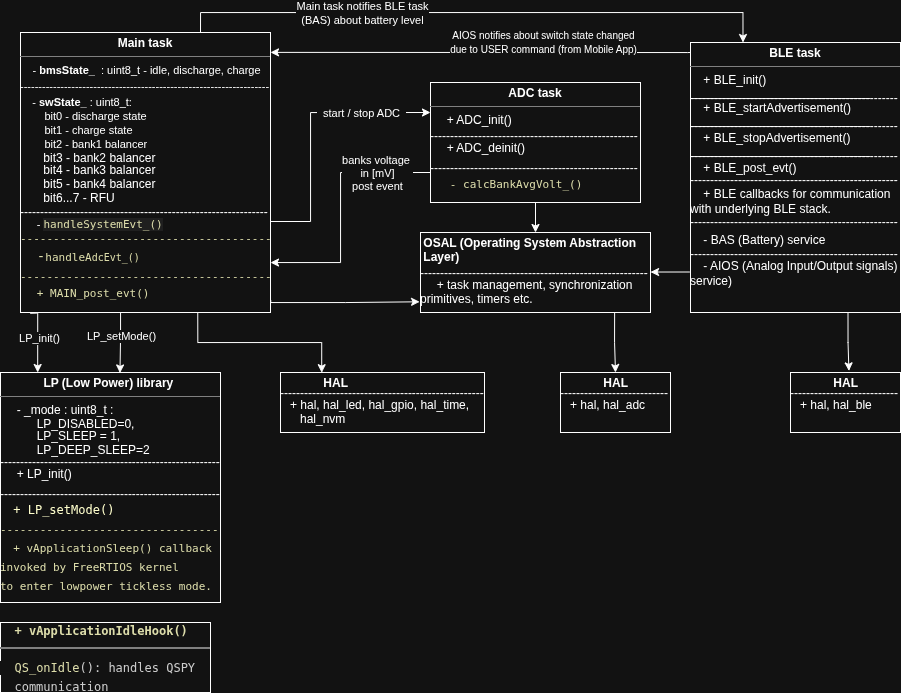

## __*Battery Management System (BMS) on MCU*__

### 1. Features  
1.1 🔋 Overcharge protection  
1.2 🔌 Overdischarge protection  
1.3 ⚖️ Cell balancing algorithm  
1.4 🔢 4S battery configuration: 4 × 3.7 V (4.2 V max) = 14.8 V nominal (16.8 V max)  
1.5 📡 MCU-controlled with BLE support  
1.6 🖥️📱 BLE desktop & mobile application  
    Available in a separate repository: https://github.com/aleksbezruk/BMS_app.git  
1.7 Schematic/block diagram  

_________________________________________________________________________________________________

### 2. Software platform
MCU firmware uses multitasking scheduling algorithm, since BLE stack requires multitasking environment and   
the manufacturer's BLE stack porting layer is based on RTOS implementation (FreeRTOS, ThtreadX etc.).  
Decided to use FreeRTOS.  
Development environment - Host PC/laptop with Ubuntu 22.04 or 24.04  
The software platform supports several ports:   
- PSOC63: tested with CYBLE-416045-02 -> CY8CPROTO-063-BLE DK  

- QN9080C: tested with QN9080-DK v1.3  
  

Firmware architecture diagram is provided below. 
  

_________________________________________________________________________________________________

### 3. Tools
3.1 Software tracing on target -> QSPY & Qview:  
> https://www.state-machine.com/qtools/qpspy.html  

3.2 Python 3 is required by QSpy, Qview, QUtest  

3.3 Visual Studio Code IDE / ModusToolbox IDE from Cypress  

3.4 Arm GNUC for Embedded toolchain  

3.5 Additional build scripts are located in __**CI-CD/build**__  

_________________________________________________________________________________________________

### 4. Testing
Unit test harness/framework -> QUtest: https://www.state-machine.com/qtools/qutest.html  

_________________________________________________________________________________________________

### 5. Integration testing framework
In general, it's preferrable to use framework based on scripting language like Python.  
For now __**pytest**__ framework is used:  
> pip install -U pytest  
> pip install pytest-dependency  
For BLE testomg the SimpleBLE library is used:  
> check installed version: pip show simplepyble  
> install: pip install simplepyble==0.10.3 OR pip install simplepyble==0.10.3 --break-system-packages  

_________________________________________________________________________________________________

### 6. Code coverage
__*gcov*__ code instrumentation feature of GCC compiler is used in order to collect a coverage data.  
The coverage data can be collected on both Target & Host systems.   
For now target testing is used. To get coverage data from target board to Host PC, use semihosting feature of debug probe.  
> When debug session is started, send cmd to debugger via "Debug Console":  
> - monitor arm semihosting enable  -> for KitProg debugger  
> - set semihosting enable on  -> for JLink  

To enable GCOV code profiling/coverage:  
- define additional compiler flags:  
> Example -> CFLAGS= -O0 -Wall -g3 -fprofile-arcs -ftest-coverage  -fprofile-filter-files="main.c qspyHelper.c;BSP.c" ;
-  define additional linker flags:  
> Example -> LDFLAGS=-fprofile-arcs -lc -lgcov -lrdimon -specs=rdimon.specs

### 7. ModusToolbox -> system & peripheral config
7.1 Install ModusToolbox Tools Package 3.2 from Infineon site.
> https://softwaretools.infineon.com/tools/com.ifx.tb.tool.modustoolbox  
> before project build, get project libraries: make getlibs  

7.2 Device Configurator  
> As described in the ModusToolbox™ tools package user guide build system chapter, you can run numerous  
> make commands in the application directory, such as launching the Device Configurator. Navigate to the application   directory and type the following command in the appropriate bash terminal window:  
> __*make device-configurator*__  

7.3 Bluetooth Configurator  
> __*make bt-configurator*__  

7.4 Project libraries manager  
> To add, remove, or modify libraries, open the Library Manager using the following command:  
> __*make library-manager*__  

_________________________________________________________________________________________________

### 8. BLE profile
8.1 Cypress BLE stack   
PSoC™ 63 Bluetooth® LE only Legacy Stack => look like is deprecated, Cypress suggest to use a new Stack  
> Source: https://github.com/Infineon/bless  
> Documentation: https://infineon.github.io/bless/ble_api_reference_manual/html/page_ble_quick_start.html  
> New stack: AIROCTM BTSTACK with Bluetooth® LE only (CYW20829, PSoC™ 63, PSoC™ 6 with CYW43xxx Connectivity device) :  
> https://github.com/Infineon/btstack  

8.2 Cypress BLE stack doc: https://documentation.infineon.com/html/psoc6/jag1667482600571.html  

8.3 Cypress BLE stack doc: https://documentation.infineon.com/html/psoc6/moa1717991724927.html#moa1717991724927  

8.4 Cypress BLE stack doc: https://github.com/infineon  

8.5 The BLE profile consist of such main services: __**Battery Service (BAS)**__ and __**Analog Input/Output Signals (AIOS)**__ .  
- BAS:  
- BAS UUID: 0x180F;  
- battery level characteristic UUID: 0x2A19;  
- battery level characteristic properties: read and notify.  
- AIOS:  
- AIOS UUID: 0x1815;  
- switch IO state characteristic value UUID: 37AF9AE2-211D-4436-9D26-3A9ED02EFEEA  
- switch IO state characteristic properties: read, write and notify.  
- full VBAT characteristic value UUID: 170AD8DB-5244-4926-963E-417099122BBA  
- full VBAT characteristic properties: read.  
- bank1 characteristic value UUID: 170AD8DB-5244-4926-963E-417099122BB1  
- bank1 characteristic properties: read.  
- bank2 characteristic value UUID: 170AD8DB-5244-4926-963E-417099122BB2  
- bank2 characteristic properties: read.  
- bank3 characteristic value UUID: 170AD8DB-5244-4926-963E-417099122BB3  
- bank3 characteristic properties: read.  
- bank4 characteristic value UUID: 170AD8DB-5244-4926-963E-417099122BB4  
- bank4 characteristic properties: read.  

_________________________________________________________________________________________________

### 9. Debugging
9.1 The main debug probe for now is native Cypress KitProg3.  
   There is also an option to use Segger J-Link debug probe.  

9.2 VScode has pluggings to support debugging for Cortex-M.  
   Like 'cortex-debug', 'RTOS view' and CPU & MCU peripherals viewers.  
   These pluggings makes VSCode suitable as development environment for firmware based on Cortex-M MCUs.  

9.3 Debug settings defined in the 'launch.json' file.  

_________________________________________________________________________________________________

### 10. BLE Client
Qt C++ framework & QtBluetooth/SimpleBLE_lib is prefered way to develop cross platform app:  
Windows, Linux, MacOS, Android, iOS   
See https://github.com/aleksbezruk/BMS_app.git .
_________________________________________________________________________________________________

## 11. QN908x port details
One of the main goal of the project is to develop BMS firmware that is ported to several MCUs from different vendors:  
- PSOC63 Cypress/Infineon ;  
- QN908x NXP ;  
- NRF52840 Nordic ;  
- an maybe more .  

To achieve this goal a HAL layer is provided.  
QN908x port development -> QN9080 DK v1.3.  

To accelerate firmware porting to QN908x the MCU Config tools will be used (power, clock, pin, peripherals config).  
*.mex - MCU Exported Configuration file - is used by NXP tool.  
> See https://www.nxp.com/design/design-center/software/development-software/mcuxpresso-software-and-tools-/mcuxpresso-config-tools-pins-clocks-and-peripherals:MCUXpresso-Config-Tools  
_________________________________________________________________________________________________

## 12. Nordic NRF52840 port details
For now NRF52840 port is suspended, this option is reserved for future.
